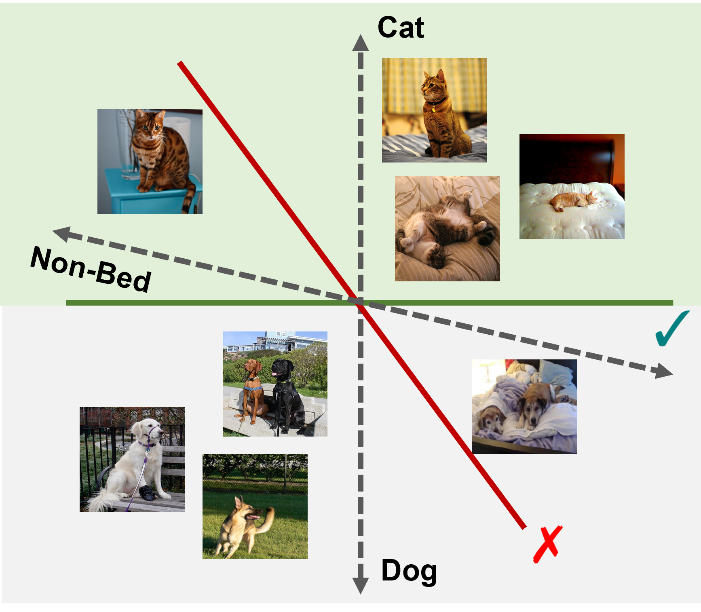
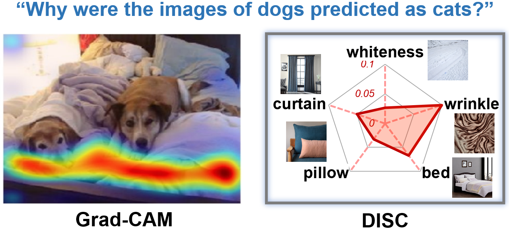
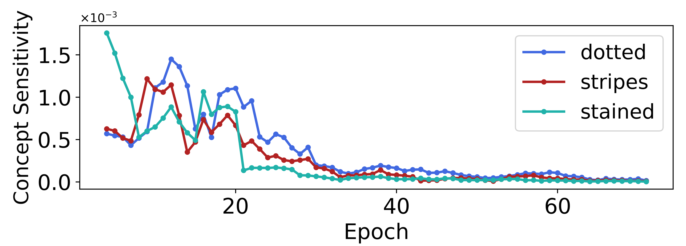
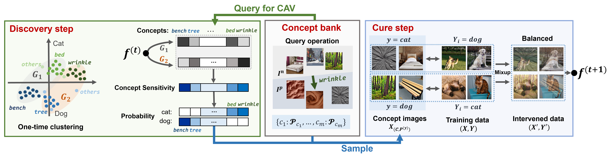

<p align="center">
    <br>
    
    <br>    
<p>

# **<u>Dis</u>cover and <u>C</u>ure: Concept-aware Mitigation of Spurious Correlation** (ICML 2023)

<div align="left">

[](https://github.com/Wuyxin/DISC/blob/master/docs/DISC_ICML23.pdf)
[](https://opensource.org/licenses/MIT)

</div>

# **Overview**

### **What is DISC?**

DISC is an algorithm on image classification tasks which adaptively discovers and removes spurious correlations during model training, using a concept bank generated by Stable Diffusion. 

### **Why DISC?**

- 🔑 Effectively remove strong spurious correlation and make models generalize better! Go for the green decision boundary! 


<p align="center">
    <br>
    
    <br>    
<p>

 - 🔎 No more ambiguous interpretations! DISC tells you exactly what attributes contribute to the spurious correlation and how significant their contributions are. 


<p align="center">
    <br>
    
    <br>    
<p>
 


- 🌱 Monitor how models learn spurious correlations!


 <p align="center">
    <br>
    
    <br>    
<p>

### **How does DISC do it?**

- Build a concept bank with multiple categories. Examples from the concept bank:

 <p align="center">
    <br>
    
    <br>    
<p>

- In each iteration, discover spurious concepts by computing a metric called concept sensitivity
- In each iteration, mix up concept images with the training dataset guided by the concept sensitivity, and update model parameters on the balanced dataset

 <p align="center">
    <br>
    
    <br>    
<p>

See [our paper](https://github.com/Wuyxin/DISC/blob/master/docs/DISC_ICML23.pdf) for details!

--------------
# **Get Started**

## **Installation**
See `requirements.txt` or install the environment via

```shell
conda create -n disc python=3.9
conda install pytorch==1.11.0 torchvision==0.12.0 torchaudio==0.11.0 cudatoolkit=11.3 -c pytorch
pip install scikit-learn transformers wilds umap-learn diffusers nltk
pip install tarfile zipfile gdown # Used for data download
```

## **Data download**

(Recommended) Download all the datasets via the commands below!

```shell
cd disc
python download_datasets.py
```
<details>
  <summary>Manual download (If auto download fails)</summary>
  <p>

  - **MetaShift**: Download the dataset from [here](https://drive.google.com/drive/folders/1Ll3-4TNU_ZRKR2VoptUTnOGTDnGDixNt?usp=sharing). Unzipping this should result in a folder `metashifts`, which should be moved as `$ROOT/data/metashifts` depending on your root directory.

  - **Waterbirds**: Download the dataset from [here](https://nlp.stanford.edu/data/dro/waterbird_complete95_forest2water2.tar.gz). Unzipping this should result in a folder `waterbird_complete95_forest2water2`. Place this folder under `$ROOT/data/cub/`.
  -  **FMoW**: Dataset download is automatic and can be found in `$ROOT/data/fmow/fmow_v1.1`. We recommend following the setup instructions provided by the official WILDS [website](https://wilds.stanford.edu/get_started/).

  -  **ISIC**: Download the dataset from [here](https://drive.google.com/drive/folders/1Ll3-4TNU_ZRKR2VoptUTnOGTDnGDixNt?usp=sharing). Unzipping this should result in a folder `isic`, which should be moved as `$ROOT/data/isic` depending on your root directory.
  </p>
</details>

## **Prepare Concept Bank**

(Recommended) Download the concept bank we have already generated via the commands below!

```shell
cd concept_bank
python download.py
```


<details>
  <summary>Manual generation. Can be used for customizing your own concept bank!</summary>
  <p>

  - Define the concept bank in `synthetic_concepts/metadata.json`
  - Run the generation using Stable Diffusion v1-4:
    ```
    cd concept_bank
    python generate_concept_bank.py --n_samples 200 
    ```
  </p>
</details>


# **Run the Training Process**

## **ERM**
We provide commands under `scripts` folder. For example, train an ERM model on MetaShift:

```shell
SEED=0
ROOT=./DISC # Set your code root here
python run_expt.py \
-s confounder -d MetaDatasetCatDog -t cat -c background --lr 0.001 --batch_size 16 \
--weight_decay 0.0001 --model resnet50 --n_epochs 100 --log_dir $ROOT/output/ \
--root_dir $ROOT/data/metashifts/MetaDatasetCatDog --save_best --save_last --seed $SEED 
```


## **DISC**

We provide commands under `scripts` folder. For example, with a trained ERM model on MetaShift, you can train the DISC model via:

```shell
SEED=0
N_CLUSTERS=2
ROOT=./DISC # Set your code root here
python run_expt.py \
-s confounder -d MetaDatasetCatDog -t cat -c background --lr 0.0005 --batch_size 16 \
--weight_decay 0.0001 --model resnet50 --n_epochs 100  --log_dir $ROOT/output/ \
--root_dir $ROOT/data/metashifts/MetaDatasetCatDog \
--erm_path <the erm model path ends with .pth> \
--concept_img_folder $ROOT/synthetic_concepts --concept_categories everything \
--n_clusters $N_CLUSTERS --augment_data --save_last --save_best --seed $SEED --disc 
```


## **Reference**

If you found this code/work to be useful in your own research, please considering citing the following:

```bibtex
@inproceedings{
    wu23disc,
    title={Discover and Cure: Concept-aware Mitigation of Spurious Correlation},
    author={Shirley Wu and Mert Yuksekgonul and Linjun Zhang and James Zou},
    booktitle={ICML},
    year={2023},
}
```
## **Contact Us**

Free feel to create an issue under this repo or contact `shirwu@cs.stanford.edu` if you have any questions!


## **TODO List**
- Make pretrained ERM models public
- Make DISC models and training log public